# Smart Printer Service

Smart Printer Service is a web application designed to manage and monitor printing services efficiently. It provides user authentication, role-based access control, printer management, order tracking, and payment integration. The application supports real-time notifications and offers a user-friendly interface for both users and administrators.

Deploy: [https://smartprinterservice-86a9c.web.app/](https://smartprinterservice-86a9c.web.app/)

**Note:** Ensure that the backend server (localhost:4000) are running to access the application.


## Routes

- `/login` - Login page
- `/register` - Register page
- `/main/user` - User dashboard
- `/main/admin` - Admin dashboard
- `/main/unauthorized` - Unauthorized access page


## Features

- **User Authentication:** Secure login and registration.
- **Role-Based Access Control:** Different views for users and admins.
- **Printer Management:** Add, update, and delete printers.
- **User Management:** Admins can manage user accounts.
- **Order Management:** Track and manage print orders.
- **Payment Integration:** Handle payments for print services.
- **Real-Time Notifications:** Get notified about important events.


## Screenshots

### User Screenshots
| 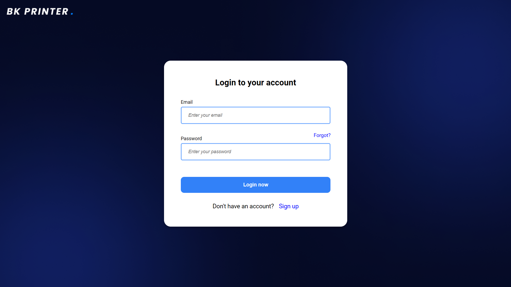 | 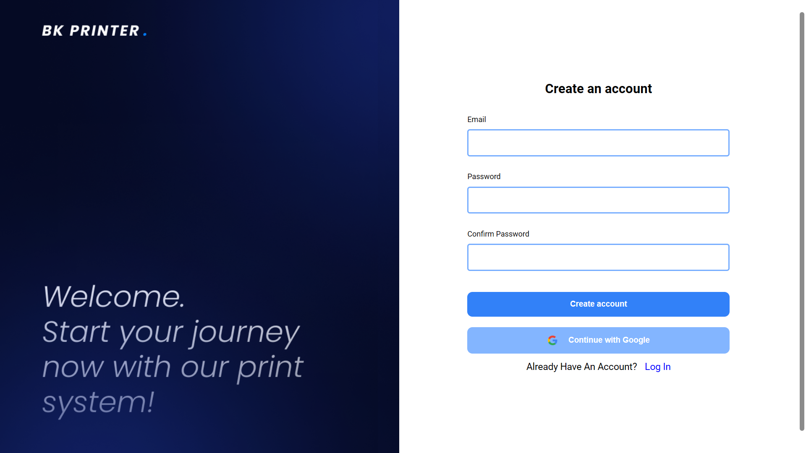 |
|:------------------------------------------------------------------------------------------:|:------------------------------------------------------------------------------------------:|
| 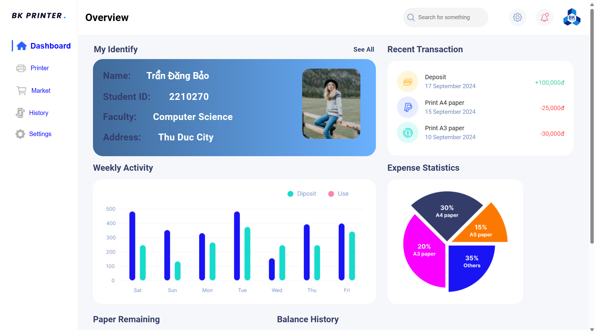 | 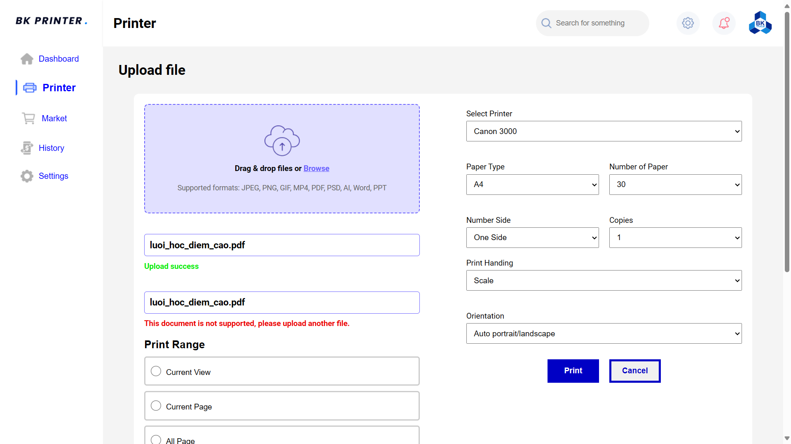 |
| 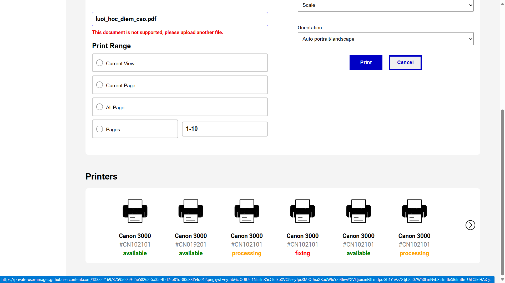 | 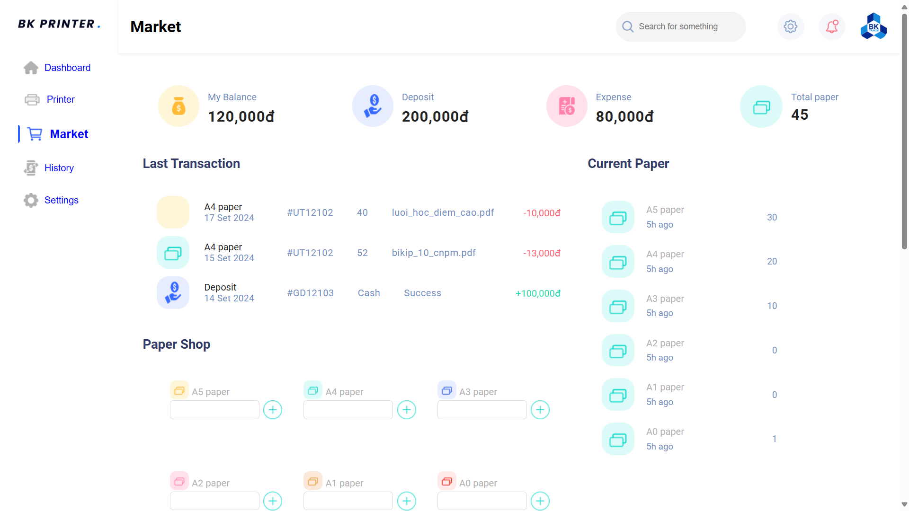 |
| 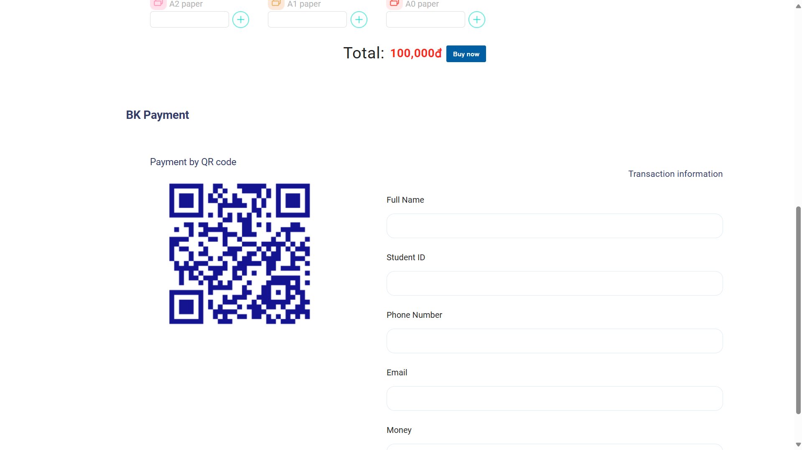 | 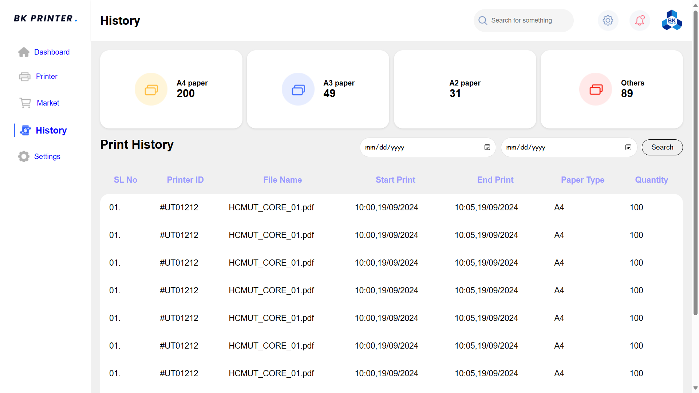 |
| 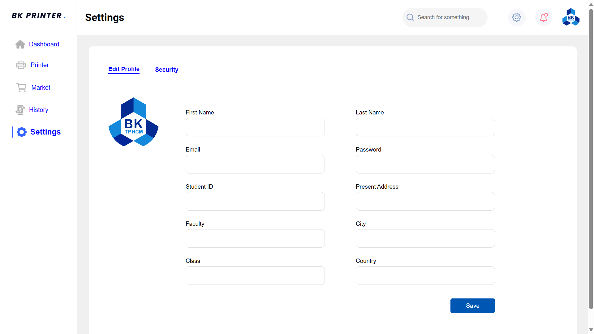 |                                                                                              |

### Admin Screenshots
| 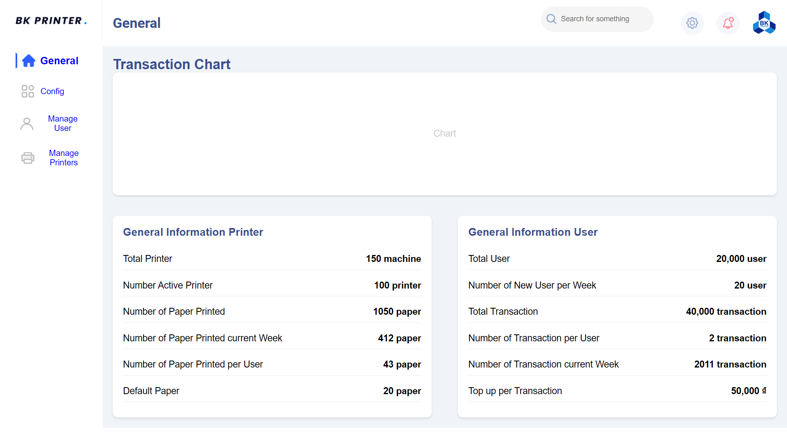 | 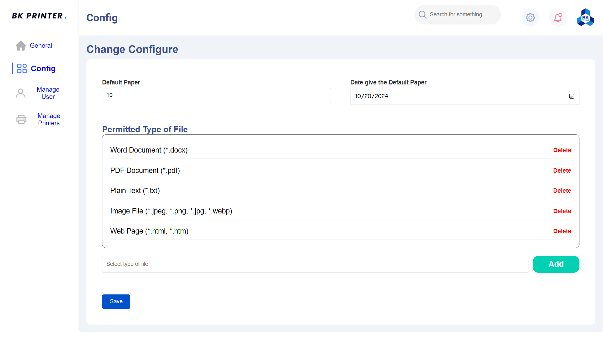 |
|:----------------------:|:----------------------:|
| 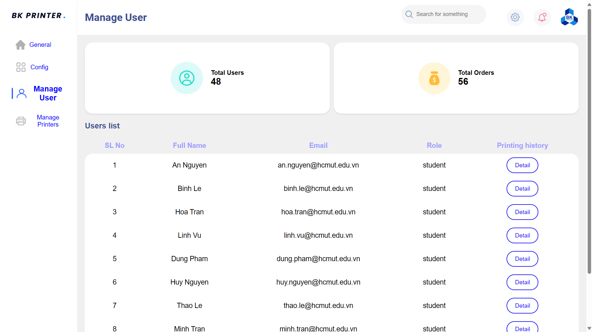 | 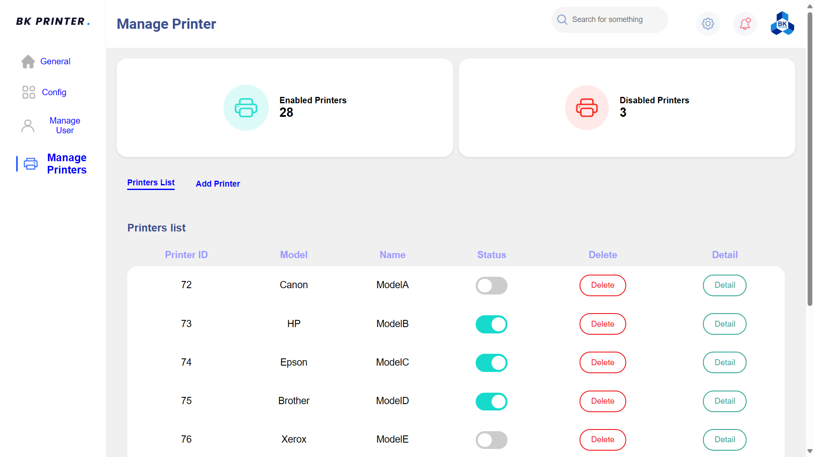 |

### Unauthorized Page
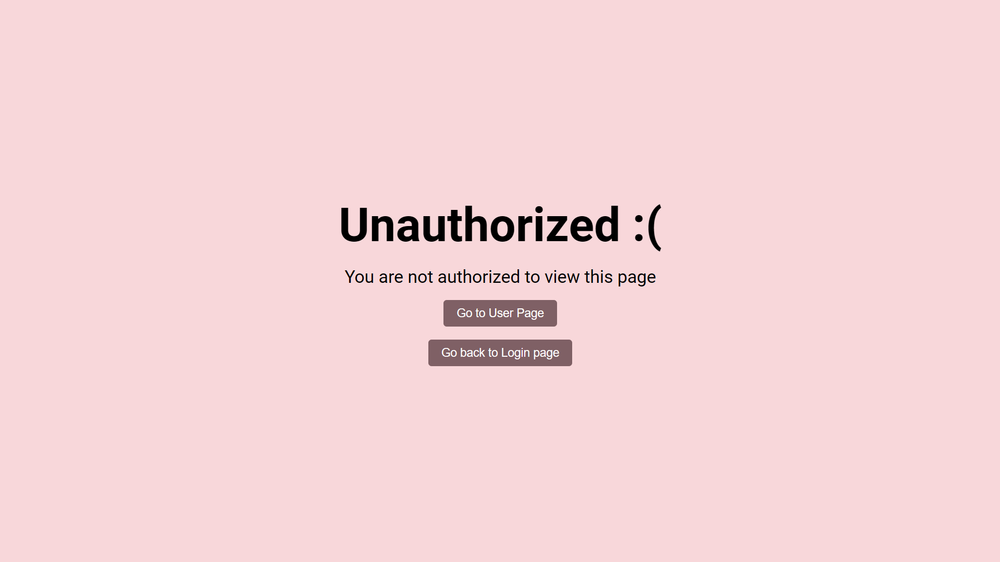

## Prerequisites

- NodeJS
- ReactJS
- PostgreSQL
- Firebase CLI

## Installation

1. Clone the repository

2. Install dependencies for backend and start the server:
    ```sh
    cd BE
    npm install
    npm start
    ```

3. Install dependencies for frontend and start:
    ```sh
    cd cnpm-client
    npm install
    npm start
    ```

